# Diagram BPMN - Proces "Złożenie i realizacja zamówienia" w sklepie FMedia

## Diagram (Mermaid)

```mermaid
graph TB
    Start([Klient wchodzi<br/>na stronę FMedia]) --> Browse[Przeglądanie<br/>produktów RTV/AGD]

    Browse --> SearchFilter{Wyszukiwanie/<br/>Filtrowanie?}
    SearchFilter -->|Tak| ApplyFilters[Zastosowanie filtrów<br/>kategoria, cena, marka]
    SearchFilter -->|Nie| ViewProduct[Przegląd produktów]
    ApplyFilters --> ViewProduct

    ViewProduct --> ProductDetails{Szczegóły<br/>produktu?}
    ProductDetails -->|Tak| ViewDetails[Wyświetlenie<br/>szczegółów produktu]
    ProductDetails -->|Nie| ViewProduct

    ViewDetails --> AddToCart{Dodać do<br/>koszyka?}
    AddToCart -->|Tak| AddItem[Dodanie produktu<br/>do koszyka]
    AddToCart -->|Nie| Browse

    AddItem --> ContinueShopping{Kontynuować<br/>zakupy?}
    ContinueShopping -->|Tak| Browse
    ContinueShopping -->|Nie| ViewCart[Przejście do koszyka]

    ViewCart --> CartReview{Edycja<br/>koszyka?}
    CartReview -->|Zmień ilość| UpdateQuantity[Aktualizacja ilości]
    CartReview -->|Usuń produkt| RemoveItem[Usunięcie produktu]
    CartReview -->|Dodaj kod rabatowy| ApplyDiscount[Zastosowanie<br/>kodu rabatowego]
    UpdateQuantity --> ViewCart
    RemoveItem --> ViewCart
    ApplyDiscount --> ViewCart

    CartReview -->|Przejdź do checkout| CheckoutStart[Start Checkout]

    %% CHECKOUT PROCESS
    CheckoutStart --> LoginCheck{Użytkownik<br/>zalogowany?}
    LoginCheck -->|Nie| GuestOrLogin{Gość czy<br/>logowanie?}
    GuestOrLogin -->|Logowanie| Login[Logowanie do konta]
    GuestOrLogin -->|Kontynuuj jako gość| GuestCheckout[Checkout jako gość]
    Login --> ShippingAddress
    LoginCheck -->|Tak| ShippingAddress[Podanie adresu<br/>dostawy]
    GuestCheckout --> ShippingAddress

    ShippingAddress --> BillingAddress{Adres do faktury<br/>taki sam?}
    BillingAddress -->|Nie| EnterBillingAddress[Podanie adresu<br/>do faktury]
    BillingAddress -->|Tak| DeliveryMethod
    EnterBillingAddress --> DeliveryMethod

    %% DELIVERY METHOD SELECTION
    DeliveryMethod[Wybór metody<br/>dostawy] --> DeliveryChoice{Jaka metoda<br/>dostawy?}

    DeliveryChoice -->|Odbiór w sklepie| PickupStore[Odbiór osobisty<br/>0,00 zł]
    DeliveryChoice -->|Kurier| CourierDelivery[Wysyłka kurierem<br/>12,99 zł]
    DeliveryChoice -->|Paczkomat InPost| InPostLocker[Paczkomat InPost 24/7<br/>9,99 zł]

    %% INPOST PARCEL LOCKER FLOW
    InPostLocker --> ValidateAddress{Adres dostawy<br/>w Polsce?}
    ValidateAddress -->|Nie| CountryError[Paczkomaty dostępne<br/>tylko w Polsce]
    CountryError --> DeliveryMethod

    ValidateAddress -->|Tak| FetchLockers[Pobranie listy Paczkomatów<br/>na podstawie adresu dostawy]

    FetchLockers --> APICheck{API InPost<br/>dostępne?}
    APICheck -->|Nie| APIError[Błąd: Nie można<br/>pobrać listy Paczkomatów]
    APIError --> RetryOrChange{Spróbować<br/>ponownie?}
    RetryOrChange -->|Tak| FetchLockers
    RetryOrChange -->|Nie| DeliveryMethod

    APICheck -->|Tak| DisplayLockers[Wyświetlenie listy<br/>Paczkomatów<br/>sortowane po odległości]
    DisplayLockers --> SelectLocker[Użytkownik wybiera<br/>Paczkomat]
    SelectLocker --> ValidateLocker{Paczkomat<br/>dostępny?}
    ValidateLocker -->|Nie| LockerUnavailable[Paczkomat pełny/<br/>nieaktywny]
    LockerUnavailable --> DisplayLockers
    ValidateLocker -->|Tak| LockerSelected[Paczkomat wybrany]

    %% CONTINUE CHECKOUT
    PickupStore --> PaymentMethod
    CourierDelivery --> PaymentMethod
    LockerSelected --> PaymentMethod

    %% PAYMENT METHOD SELECTION
    PaymentMethod[Wybór metody<br/>płatności] --> PaymentChoice{Jaka metoda<br/>płatności?}

    PaymentChoice -->|Karta płatnicza| CardPayment[Płatność kartą<br/>Przelewy24/PayU]
    PaymentChoice -->|BLIK| BlikPayment[Płatność BLIK]
    PaymentChoice -->|Przelew tradycyjny| BankTransfer[Przelew bankowy]
    PaymentChoice -->|Za pobraniem| COD[Płatność za pobraniem]

    CardPayment --> OrderSummary
    BlikPayment --> OrderSummary
    BankTransfer --> OrderSummary
    COD --> OrderSummary

    OrderSummary[Podsumowanie<br/>zamówienia] --> TermsAccept{Akceptacja<br/>regulaminu?}
    TermsAccept -->|Nie| TermsError[Musisz zaakceptować<br/>regulamin]
    TermsError --> TermsAccept
    TermsAccept -->|Tak| PlaceOrder[Kliknięcie<br/>Złóż zamówienie]

    %% ORDER VALIDATION
    PlaceOrder --> ValidateOrder{Walidacja<br/>zamówienia}
    ValidateOrder -->|Produkty za duże<br/>dla Paczkomatu| SizeError[Błąd: Produkty zbyt duże<br/>dla Paczkomatu]
    SizeError --> DeliveryMethod

    ValidateOrder -->|Produkt<br/>niedostępny| StockError[Błąd: Produkt<br/>niedostępny w magazynie]
    StockError --> ViewCart

    ValidateOrder -->|OK| CreateOrder[Utworzenie zamówienia<br/>w systemie Magento]

    %% PAYMENT PROCESSING
    CreateOrder --> ProcessPayment{Typ<br/>płatności?}

    ProcessPayment -->|Online| OnlinePayment[Przekierowanie<br/>do bramki płatności]
    OnlinePayment --> PaymentGateway{Status<br/>płatności?}
    PaymentGateway -->|Sukces| PaymentSuccess[Płatność potwierdzona]
    PaymentGateway -->|Błąd| PaymentFailed[Płatność nieudana]
    PaymentGateway -->|Anulowana| PaymentCancelled[Płatność anulowana]

    PaymentFailed --> RetryPayment{Spróbować<br/>ponownie?}
    RetryPayment -->|Tak| OnlinePayment
    RetryPayment -->|Nie| OrderCancelled[Zamówienie anulowane]

    PaymentCancelled --> OrderCancelled

    ProcessPayment -->|Przelew| BankTransferPending[Oczekiwanie<br/>na przelew]
    ProcessPayment -->|Za pobraniem| CODPending[Płatność przy<br/>odbiorze]

    PaymentSuccess --> SendConfirmation
    BankTransferPending --> CheckTransfer{Przelew<br/>otrzymany?}
    CheckTransfer -->|Nie| WaitTransfer[Czekaj na przelew<br/>max 7 dni]
    WaitTransfer --> CheckTransfer
    CheckTransfer -->|Tak| SendConfirmation

    CODPending --> SendConfirmation

    %% ORDER CONFIRMATION
    SendConfirmation[Wysłanie email<br/>potwierdzenie zamówienia] --> OrderConfirmed[Status: Zamówienie<br/>potwierdzone]

    %% WAREHOUSE PROCESSING
    OrderConfirmed --> WarehouseNotification[Powiadomienie<br/>magazynu o zamówieniu]
    WarehouseNotification --> PickItems[Kompletowanie<br/>produktów w magazynie]
    PickItems --> QualityCheck[Kontrola jakości<br/>produktów]
    QualityCheck --> PackOrder[Pakowanie<br/>zamówienia]

    %% SHIPPING LABEL GENERATION
    PackOrder --> ShippingMethod{Metoda<br/>dostawy?}

    ShippingMethod -->|Kurier| CourierLabel[Generowanie etykiety<br/>kurierskiej]
    ShippingMethod -->|Paczkomat InPost| InPostLabel[Generowanie etykiety<br/>InPost Paczkomat]
    ShippingMethod -->|Odbiór osobisty| ReadyForPickup[Status: Gotowe<br/>do odbioru]

    CourierLabel --> CourierLabelCheck{Etykieta<br/>wygenerowana?}
    CourierLabelCheck -->|Nie| CourierLabelError[Błąd generowania<br/>etykiety]
    CourierLabelError --> NotifySupport[Powiadomienie<br/>supportu]
    CourierLabelCheck -->|Tak| CourierHandover

    InPostLabel --> InPostLabelCheck{Etykieta<br/>InPost OK?}
    InPostLabelCheck -->|Nie| InPostLabelError[Błąd API InPost]
    InPostLabelError --> NotifySupport
    InPostLabelCheck -->|Tak| InPostHandover

    NotifySupport --> ManualProcessing[Ręczna obsługa<br/>przez support]
    ManualProcessing --> ShippingMethod

    %% DELIVERY PROCESS
    CourierHandover[Przekazanie<br/>paczki kurierowi] --> CourierTransit[Paczka w transporcie<br/>kurier]
    InPostHandover[Nadanie paczki<br/>do InPost] --> InPostTransit[Paczka w transporcie<br/>InPost]

    CourierTransit --> CourierDeliveryAttempt{Dostawa<br/>udana?}
    CourierDeliveryAttempt -->|Nie| CourierRetry{Ponowna<br/>próba?}
    CourierRetry -->|Tak, max 3 próby| CourierTransit
    CourierRetry -->|Nie| ReturnToSender[Zwrot do<br/>nadawcy]
    CourierDeliveryAttempt -->|Tak| CourierDelivered[Dostawa do klienta<br/>podpis klienta]

    InPostTransit --> InPostLoading[Załadunek do<br/>Paczkomatu]
    InPostLoading --> InPostReady[Paczka w Paczkomacie<br/>gotowa do odbioru]
    InPostReady --> NotifyCustomer[Powiadomienie klienta<br/>SMS + Email + Push]
    NotifyCustomer --> WaitPickup[Oczekiwanie na odbiór<br/>max 48h]

    WaitPickup --> PickupCheck{Klient<br/>odebrał?}
    PickupCheck -->|Nie, upłynął termin| ReturnToSender
    PickupCheck -->|Tak| InPostPickup[Odbiór z Paczkomatu<br/>kod SMS/QR]

    ReadyForPickup --> StoreNotification[Powiadomienie klienta<br/>o gotowości]
    StoreNotification --> StorePickup[Odbiór w sklepie<br/>okazanie dokumentu]

    %% DELIVERY COMPLETED
    CourierDelivered --> DeliveryCompleted[Status: Dostarczone]
    InPostPickup --> DeliveryCompleted
    StorePickup --> DeliveryCompleted
    ReturnToSender --> OrderFailed[Status: Dostawa<br/>nieudana - zwrot]

    DeliveryCompleted --> CustomerSatisfied{Klient<br/>zadowolony?}

    %% RETURN PROCESS
    CustomerSatisfied -->|Nie, chce zwrócić| ReturnEligible{W okresie<br/>zwrotu 14 dni?}
    ReturnEligible -->|Nie| ReturnExpired[Okres zwrotu<br/>upłynął]
    ReturnExpired --> ContactSupport[Kontakt z obsługą<br/>klienta]

    ReturnEligible -->|Tak| InitiateReturn[Inicjowanie zwrotu<br/>w aplikacji/stronie]
    InitiateReturn --> SelectReturnItems[Wybór produktów<br/>do zwrotu]
    SelectReturnItems --> SelectReturnReason[Wybór przyczyny<br/>zwrotu]

    SelectReturnReason --> ReturnMethod{Metoda<br/>zwrotu?}
    ReturnMethod -->|Kurier odbierze| CourierReturn[Kurier odbiera<br/>paczkę od klienta]
    ReturnMethod -->|Paczkomat InPost| InPostReturn[Zwrot przez<br/>Paczkomat InPost]

    %% INPOST RETURN FLOW
    InPostReturn --> GenerateReturnLabel[Generowanie etykiety<br/>zwrotnej InPost]
    GenerateReturnLabel --> ReturnLabelCheck{Etykieta<br/>OK?}
    ReturnLabelCheck -->|Nie| ReturnLabelError[Błąd generowania<br/>etykiety zwrotnej]
    ReturnLabelError --> RetryReturnLabel{Spróbować<br/>ponownie?}
    RetryReturnLabel -->|Tak| GenerateReturnLabel
    RetryReturnLabel -->|Nie| ContactSupport

    ReturnLabelCheck -->|Tak| SendReturnLabel[Wysłanie etykiety<br/>Email + Push]
    SendReturnLabel --> CustomerPacksReturn[Klient pakuje<br/>produkt]
    CustomerPacksReturn --> CustomerDropsOff[Klient nadaje<br/>w Paczkomacie]
    CustomerDropsOff --> ReturnInTransit[Zwrot w transporcie]

    CourierReturn --> ReturnInTransit

    %% RETURN PROCESSING
    ReturnInTransit --> ReturnDelivered[Zwrot dostarczony<br/>do magazynu]
    ReturnDelivered --> InspectReturn[Inspekcja zwrotu<br/>przez magazyn]
    InspectReturn --> ReturnCondition{Stan<br/>produktu?}

    ReturnCondition -->|Dobry| ReturnApproved[Zwrot zaakceptowany]
    ReturnCondition -->|Uszkodzony przez klienta| ReturnRejected[Zwrot odrzucony]

    ReturnRejected --> NotifyRejection[Powiadomienie klienta<br/>o odrzuceniu]
    NotifyRejection --> ContactSupport

    ReturnApproved --> ProcessRefund[Przetwarzanie<br/>zwrotu płatności]
    ProcessRefund --> RefundGateway{Metoda<br/>płatności?}

    RefundGateway -->|Karta/BLIK| AutoRefund[Automatyczny zwrot<br/>na kartę 3-5 dni]
    RefundGateway -->|Przelew| ManualRefund[Ręczny zwrot<br/>przez dział finansowy]
    RefundGateway -->|Za pobraniem| BankDetailsRequest[Prośba o dane<br/>do przelewu]
    BankDetailsRequest --> ManualRefund

    AutoRefund --> RefundSuccess{Zwrot<br/>udany?}
    RefundSuccess -->|Tak| RefundCompleted[Zwrot zrealizowany]
    RefundSuccess -->|Nie| RefundFailed[Błąd zwrotu<br/>płatności]
    RefundFailed --> ManualRefund

    ManualRefund --> RefundCompleted

    RefundCompleted --> NotifyRefund[Powiadomienie klienta<br/>Email: Środki zwrócone]
    NotifyRefund --> ReturnClosed[Status: Zwrot<br/>zamknięty]

    %% HAPPY PATH END
    CustomerSatisfied -->|Tak| OrderCompleted[Zamówienie<br/>zrealizowane pomyślnie]

    %% END STATES
    OrderCompleted --> End([Koniec procesu])
    ReturnClosed --> End
    OrderCancelled --> End
    OrderFailed --> End
    ContactSupport --> End

    %% STYLING
    classDef startEnd fill:#90EE90,stroke:#333,stroke-width:2px,color:#000
    classDef process fill:#87CEEB,stroke:#333,stroke-width:1px,color:#000
    classDef decision fill:#FFD700,stroke:#333,stroke-width:2px,color:#000
    classDef error fill:#FFB6C1,stroke:#333,stroke-width:2px,color:#000
    classDef inpost fill:#FFA500,stroke:#333,stroke-width:2px,color:#000

    class Start,End startEnd
    class SizeError,StockError,APIError,PaymentFailed,CourierLabelError,InPostLabelError,ReturnLabelError,RefundFailed,ReturnRejected error
    class InPostLocker,RequestLocation,GetGPS,FetchLockers,DisplayLockers,SelectLocker,ValidateLocker,LockerSelected,InPostLabel,InPostHandover,InPostTransit,InPostLoading,InPostReady,InPostPickup,InPostReturn,GenerateReturnLabel inpost
```

---

## Legenda

| Symbol | Znaczenie | Opis |
|--------|-----------|------|
| Owal zielony | Start/End | Początek i koniec procesu |
| Prostokąt niebieski | Zadanie | Pojedyncza czynność/krok procesu |
| Romb żółty | Bramka decyzyjna | Punkt decyzyjny z wieloma ścieżkami |
| Prostokąt pomarańczowy | InPost | Kroki związane z integracją InPost |
| Prostokąt różowy | Błąd | Stany błędów wymagające obsługi |

