# Diagram UML - Wybór Paczkomatu jako formy dostawy

### Opis procesu
1. Użytkownik przechodzi do checkout i wypełnia dane odbiorcy (w tym pełny adres dostawy)
2. Użytkownik wybiera metodę dostawy "Paczkomaty InPost" (opcja dostępna tylko dla adresów w Polsce)
3. Aplikacja mobilna wysyła adres dostawy do backendu i pobiera listę dostępnych Paczkomatów
4. Backend geocoduje adres dostawy, następnie komunikuje się z InPost API, aby pobrać aktualne dane
5. Użytkownik wybiera konkretny Paczkomat z listy
6. Wybór jest zapisywany w zamówieniu
7. Użytkownik finalizuje zamówienie z wybranym Paczkomatem

### Komponenty systemu

1. **iOS App** - aplikacja mobilna klienta FMedia
2. **Backend API** - serwer Magento 2 z REST API
3. **InPost API** - zewnętrzny serwis InPost dostarczający dane o Paczkomatach

## Diagram (Mermaid)

```mermaid
sequenceDiagram
    autonumber
    actor User as Użytkownik
    participant iOS as iOS App
    participant Backend as Magento Backend API
    participant Cache as Redis Cache
    participant InPost as InPost API
    participant DB as Database (Magento)

    Note over User,DB: 🛒 Checkout - Wypełnienie danych odbiorcy

    User->>iOS: Wypełnienie formularza danych odbiorcy:<br/>- Imię, nazwisko<br/>- Ulica, numer<br/>- Kod pocztowy, miasto<br/>- Kraj
    iOS->>iOS: Walidacja danych odbiorcy

    alt Adres dostawy w Polsce
        iOS->>iOS: Wyświetlenie opcji "Paczkomaty InPost"<br/>w sekcji metod dostawy
    else Adres dostawy poza Polską
        iOS->>iOS: Ukrycie opcji "Paczkomaty InPost"<br/>(tylko dostawa międzynarodowa)
        Note right of iOS: Walidacja kraju
    end

    User->>iOS: Kliknięcie "Wybierz dostawę"
    iOS->>iOS: Wyświetlenie modalu z opcjami dostawy
    User->>iOS: Wybór "Paczkomaty InPost 24/7"

    Note over iOS,InPost: 🗺️ Pobieranie listy Paczkomatów (na podstawie adresu dostawy)

    iOS->>Backend: GET /api/v1/inpost/parcel-lockers<br/>?address=ul. Marszałkowska 1, 00-001 Warszawa&radius=5
    activate Backend

    Backend->>Backend: Walidacja parametrów (address, radius)
    Backend->>Backend: Geocoding adresu:<br/>"ul. Marszałkowska 1, 00-001 Warszawa"<br/>→ lat: 52.2297, lng: 21.0122

    alt Geocoding - błąd
        Backend-->>iOS: 422 Unprocessable Entity<br/>{error: "Unable to geocode address"}
        iOS->>User: "Nie można znaleźć podanego adresu.<br/>Sprawdź dane i spróbuj ponownie."
    else Geocoding - sukces
        Backend->>Backend: Walidacja kraju (czy country = "PL")

        alt Kraj poza Polską
            Backend-->>iOS: 200 OK + pusta lista<br/>{data: [], meta: {message: "Parcel lockers only in Poland"}}
            iOS->>User: "Paczkomaty InPost dostępne tylko w Polsce.<br/>Wybierz inną metodę dostawy."
        else Kraj = Polska
            Backend->>Cache: Sprawdzenie cache<br/>key: parcel_lockers:hash(address):5
            activate Cache

            alt Cache HIT
                Cache-->>Backend: Zwrócenie danych z cache
                Note right of Cache: Cache TTL: 1 godzina
                Backend-->>iOS: 200 OK + lista Paczkomatów
            else Cache MISS
                Cache-->>Backend: Brak danych w cache

                Backend->>InPost: GET /v1/points<br/>?latitude=52.2297&longitude=21.0122&radius=5000
                activate InPost

                alt InPost API - sukces
                    InPost-->>Backend: 200 OK + lista Paczkomatów (JSON)
                    Backend->>Backend: Mapowanie danych InPost → format FMedia
                    Backend->>Backend: Obliczanie odległości od adresu dostawy (Haversine)
                    Backend->>Backend: Sortowanie po odległości (ASC)
                    Backend->>Cache: Zapisanie w cache (TTL: 1h)
                    Backend-->>iOS: 200 OK + lista Paczkomatów
                else InPost API - błąd/timeout
                    InPost-->>Backend: 503 Service Unavailable / Timeout
                    Backend-->>iOS: 503 Service Unavailable<br/>{error: "InPost service unavailable. Please try again."}
                    iOS->>User: "Nie udało się pobrać listy Paczkomatów.<br/>Spróbuj ponownie."
                    Note over iOS: Przycisk "Spróbuj ponownie"
                end
                deactivate InPost
            end
            deactivate Cache
        end
    end
    deactivate Backend

    iOS->>iOS: Renderowanie listy Paczkomatów<br/>(nazwa, adres, odległość)
    iOS->>User: Wyświetlenie listy Paczkomatów<br/>(posortowane po odległości)

    Note over User,DB: ✅ Wybór Paczkomatu

    User->>iOS: Wybór Paczkomatu (kliknięcie)<br/>np. "Paczkomat WAW1234"
    iOS->>iOS: Zaznaczenie wybranego Paczkomatu<br/>(radio button)
    iOS->>iOS: Zapisanie w lokalnym state

    opt Użytkownik rozszerza szczegóły
        User->>iOS: Kliknięcie chevron (rozwinięcie)
        iOS->>User: Wyświetlenie szczegółów:<br/>- Pełny adres<br/>- Godziny dostępności<br/>- Status
    end

    User->>iOS: Kliknięcie "Potwierdź" / nawigacja wstecz
    iOS->>iOS: Walidacja: czy Paczkomat wybrany?

    alt Brak wyboru
        iOS->>User: "Wybierz Paczkomat, aby kontynuować"
    else Wybór poprawny
        iOS->>iOS: Powrót do ekranu checkout
        iOS->>iOS: Aktualizacja UI sekcji "Dostawa":<br/>- Nazwa Paczkomatu<br/>- Adres<br/>- Cena (9,99 zł)
    end

    Note over User,DB: 🛍️ Finalizacja zamówienia

    User->>iOS: Wypełnienie danych do faktury
    User->>iOS: Wybór metody płatności
    User->>iOS: Kliknięcie "Złóż zamówienie"

    iOS->>Backend: POST /api/v1/orders<br/>{<br/>  items: [...],<br/>  delivery_method: "INPOST_LOCKER",<br/>  parcel_locker: {<br/>    id: "WAW1234",<br/>    name: "Paczkomat WAW1234",<br/>    address: "ul. Biblioteczna 10..."<br/>  },<br/>  payment_method: "...",<br/>  ...<br/>}
    activate Backend

    Backend->>Backend: Walidacja zamówienia

    Backend->>InPost: GET /v1/points/WAW1234<br/>(weryfikacja dostępności Paczkomatu)
    activate InPost

    alt Paczkomat dostępny + Produkty mieszczą się
        InPost-->>Backend: 200 OK + status: available
        Backend->>Backend: Walidacja wymiarów produktów<br/>vs. wymiary skrytek Paczkomatu
        Backend->>DB: Zapisanie zamówienia
        activate DB
        DB->>DB: INSERT INTO sales_order<br/>(delivery_method: INPOST_LOCKER,<br/>parcel_locker_id: WAW1234, ...)
        DB-->>Backend: Zamówienie zapisane (order_id: #12345)
        deactivate DB
        Backend->>Backend: Inicjalizacja płatności
        Backend-->>iOS: 201 Created<br/>{order_id: #12345, payment_url: "..."}
        iOS->>User: Przekierowanie do płatności

    else Paczkomat dostępny + Produkty za duże
        InPost-->>Backend: 200 OK + status: available
        Backend->>Backend: Walidacja wymiarów produktów<br/>vs. wymiary skrytek Paczkomatu
        Backend-->>iOS: 422 Unprocessable Entity<br/>{"error": "Products too large for Parcel Locker"}
        iOS->>User: "Produkty w koszyku są zbyt duże<br/>dla wybranego Paczkomatu.<br/>Wybierz inną metodę dostawy."

    else Paczkomat niedostępny/pełny
        InPost-->>Backend: 200 OK + status: unavailable
        Backend-->>iOS: 422 Unprocessable Entity<br/>{"error": "Parcel Locker unavailable"}
        iOS->>User: "Wybrany Paczkomat jest obecnie niedostępny.<br/>Wybierz inny Paczkomat."
        User->>iOS: Powrót do wyboru Paczkomatu
    end
    deactivate InPost
    deactivate Backend

    Note over User,DB: ✅ Zamówienie złożone pomyślnie

```

---

## Opisy kroków

### 1-3: Wypełnienie danych odbiorcy
- Użytkownik wchodzi w proces checkout
- Wypełnia formularz danych odbiorcy: imię, nazwisko, pełny adres dostawy (ulica, numer, kod pocztowy, miasto, kraj)
- Aplikacja waliduje kompletność danych

### 4-6: Walidacja kraju i dostępność Paczkomatów
- Aplikacja sprawdza kraj adresu dostawy
- Jeśli adres w Polsce: wyświetla opcję "Paczkomaty InPost 24/7" w metodach dostawy
- Jeśli adres poza Polską: ukrywa opcję Paczkomatów (tylko dostawa międzynarodowa)

### 7-9: Wybór opcji dostawy
- Użytkownik klika "Wybierz dostawę"
- Widzi modal z opcjami dostawy
- Wybiera opcję "Paczkomaty InPost 24/7"

### 10-12: Żądanie listy Paczkomatów
- iOS App wysyła żądanie do backendu z adresem dostawy jako parametr
- Backend waliduje parametry (address, radius)
- Backend geocoduje adres dostawy na współrzędne (lat, lng)

### 13-15: Walidacja kraju po stronie backendu
- Backend sprawdza czy geocodowany adres jest w Polsce
- Jeśli tak: kontynuuje pobieranie Paczkomatów
- Jeśli nie: zwraca pustą listę z komunikatem o dostępności tylko w Polsce

### 16-19: Cache
- Backend sprawdza czy dane są w cache (Redis) używając hash adresu jako klucza
- Jeśli tak (Cache HIT), zwraca dane z cache (szybka odpowiedź)
- Jeśli nie (Cache MISS), przechodzi do zapytania InPost API

### 20-22: Zapytanie do InPost API
- Backend wysyła żądanie do InPost API z geocodowanymi współrzędnymi
- InPost zwraca listę Paczkomatów w formacie JSON

### 23-26: Przetwarzanie danych
- Backend mapuje dane z formatu InPost na format FMedia
- Oblicza odległość od adresu dostawy (wzór Haversine)
- Sortuje Paczkomaty po odległości rosnąco
- Zapisuje przetworzone dane w cache z TTL 1 godzina

### 27-28: Zwrócenie danych do iOS
- Backend zwraca listę Paczkomatów do aplikacji mobilnej
- iOS renderuje listę

### 29-30: Wyświetlenie listy
- Użytkownik widzi listę Paczkomatów posortowanych po odległości od adresu dostawy
- Każdy Paczkomat pokazuje: nazwę, adres, odległość

### 25-28: Wybór Paczkomatu
- Użytkownik wybiera konkretny Paczkomat (kliknięcie)
- iOS zaznacza wybrany Paczkomat (radio button)
- Wybór zapisywany w lokalnym state aplikacji

### 29-31: Rozszerzenie szczegółów (opcjonalne)
- Użytkownik może rozwinąć szczegóły Paczkomatu
- Widzi pełny adres, godziny, status

### 32-36: Potwierdzenie wyboru
- Użytkownik potwierdza wybór lub wraca do checkout
- Walidacja: czy Paczkomat został wybrany
- Aktualizacja UI z informacją o wybranym Paczkomacie

### 37-41: Złożenie zamówienia
- Użytkownik wypełnia dane do faktury
- Wybiera metodę płatności
- Klika "Złóż zamówienie"
- iOS wysyła pełne dane zamówienia do backendu

### 42-44: Walidacja zamówienia
- Backend waliduje zamówienie
- Sprawdza dostępność Paczkomatu w InPost API
- Weryfikuje, czy produkty mieszczą się w Paczkomacie

### 45-48: Zapisanie zamówienia
- Jeśli wszystko OK, zamówienie jest zapisywane w bazie danych
- Backend inicjalizuje płatność
- Zwraca potwierdzenie do iOS

### 49: Przekierowanie do płatności
- Użytkownik jest przekierowywany do bramki płatności
