# Diagram UML - Zwrot produktu przez Paczkomat InPost

### Opis procesu
1. Użytkownik przegląda zamówienia i inicjuje zwrot
2. Wybiera produkty do zwrotu i przyczynę
3. Wybiera Paczkomat, do którego nada zwrot
4. Generuje etykietę zwrotną InPost
5. Nadaje paczkę w Paczkomacie
6. Śledzi status zwrotu
7. Otrzymuje zwrot pieniędzy

### Komponenty systemu:
- **iOS App** - aplikacja mobilna klienta FMedia
- **Backend API** - serwer Magento 2 z REST API i modułem RMA
- **InPost API** - zewnętrzny serwis InPost (etykiety, tracking)
- **Payment Gateway** - bramka płatności (Przelewy24, PayU, etc.)
- **Email Service** - serwis email (SendGrid, SMTP)
- **Push Notifications** - APNs (Apple Push Notification service)

## Diagram (Mermaid)

```mermaid
sequenceDiagram
    autonumber
    actor User as Użytkownik
    participant iOS as iOS App
    participant Backend as Magento Backend API
    participant RMA as Magento RMA Module
    participant InPost as InPost API
    participant DB as Database
    participant Payment as Payment Gateway
    participant Email as Email Service
    participant Push as Push Notifications (APNs)

    Note over User,Push: 📦 FAZA 1: Inicjowanie zwrotu

    User->>iOS: Wejście do "Moje zamówienia"
    iOS->>Backend: GET /api/v1/orders?customer_id={userId}
    Backend->>DB: SELECT * FROM sales_order WHERE customer_id=...
    DB-->>Backend: Lista zamówień
    Backend-->>iOS: 200 OK + lista zamówień
    iOS->>User: Wyświetlenie listy zamówień

    User->>iOS: Kliknięcie na zamówienie #12345
    iOS->>Backend: GET /api/v1/orders/12345
    Backend->>DB: SELECT * FROM sales_order WHERE id=12345
    DB-->>Backend: Szczegóły zamówienia
    Backend->>Backend: Sprawdzenie okresu zwrotu<br/>(dostarczone + 14 dni)
    Backend-->>iOS: 200 OK + szczegóły + can_return: true
    iOS->>User: Wyświetlenie szczegółów + przycisk "Zwróć produkty"

    User->>iOS: Kliknięcie "Zwróć produkty"
    iOS->>User: Wyświetlenie listy produktów z zamówienia<br/>(checkboxy do wyboru)

    User->>iOS: Zaznaczenie produktów do zwrotu<br/>np. 2 z 3 produktów
    iOS->>iOS: Obliczenie potencjalnej kwoty zwrotu
    iOS->>User: Wyświetlenie podsumowania:<br/>"Zwracasz 2 produkty, kwota: 599 zł"

    User->>iOS: Kliknięcie "Dalej"
    iOS->>User: Wyświetlenie listy przyczyn zwrotu

    User->>iOS: Wybór przyczyny: "Produkt niezgodny z opisem"
    opt Inna przyczyna
        User->>iOS: Wpisanie szczegółów w polu tekstowym
    end

    User->>iOS: Kliknięcie "Dalej"

    Note over iOS,InPost: 📍 Wybór Paczkomatu dla zwrotu

    iOS->>iOS: Sprawdzenie uprawnień do lokalizacji
    iOS->>iOS: Pobranie współrzędnych GPS
    iOS->>Backend: GET /api/v1/inpost/parcel-lockers<br/>?lat=52.2297&lng=21.0122&radius=5
    Backend->>InPost: GET /v1/points?latitude=...
    InPost-->>Backend: Lista Paczkomatów
    Backend->>Backend: Filtrowanie Paczkomatów<br/>(wymiary skrytek >= wymiary produktów)
    Backend-->>iOS: 200 OK + lista Paczkomatów
    iOS->>User: Wyświetlenie listy Paczkomatów<br/>(sugerowany: Paczkomat z którego odebrano)

    User->>iOS: Wybór Paczkomatu WAW1234
    User->>iOS: Kliknięcie "Dalej"

    Note over User,Push: 🏷️ FAZA 2: Generowanie etykiety zwrotnej

    iOS->>Backend: POST /api/v1/orders/12345/returns<br/>(items, reason, parcel_locker_id: WAW1234)
    activate Backend

    Backend->>Backend: Walidacja:<br/>- Okres zwrotu OK?<br/>- Produkty podlegają zwrotowi?

    alt Walidacja OK
        Backend->>RMA: Utworzenie RMA (Return Merchandise Authorization)
        activate RMA
        RMA->>DB: INSERT INTO magento_rma<br/>(order_id, items, reason, status: pending)
        DB-->>RMA: RMA utworzone (rma_id: RET-2025-001234)
        RMA-->>Backend: RMA ID
        deactivate RMA

        Backend->>InPost: POST /v1/shipments/returns<br/>(receiver, sender, parcel_locker: WAW1234, dimensions, weight)
        activate InPost

        alt InPost - sukces
            InPost->>InPost: Generowanie etykiety zwrotnej
            InPost-->>Backend: 201 Created (tracking_number: INP123456789012345, label_url: https://inpost.pl/labels/INP...pdf, qr_code)

            Backend->>DB: UPDATE magento_rma<br/>SET tracking_number='INP123...',<br/>    label_url='https://...',<br/>    status='label_generated'
            DB-->>Backend: Zaktualizowane

            Backend-->>iOS: 201 Created (return_id: RET-2025-001234, tracking_number: INP123..., label_url, qr_code, status: label_generated)

        else InPost - błąd
            InPost-->>Backend: 503 Service Unavailable
            Backend-->>iOS: 503 Service Unavailable (error: InPost service unavailable)
            iOS->>User: "Nie udało się wygenerować etykiety.<br/>Spróbuj ponownie później."
        end
        deactivate InPost

    else Walidacja failed
        Backend-->>iOS: 422 Unprocessable Entity (error: Return period expired)
        iOS->>User: "Okres zwrotu upłynął.<br/>Skontaktuj się z obsługą klienta."
    end
    deactivate Backend

    iOS->>User: Wyświetlenie ekranu potwierdzenia:<br/>- Numer zwrotu: RET-2025-001234<br/>- Kod QR<br/>- Przycisk "Pobierz etykietę PDF"<br/>- Przycisk "Zapisz QR do zdjęć"

    Note over Backend,Email: 📧 Wysłanie email z potwierdzeniem

    Backend->>Email: Wysłanie email z etykietą zwrotną
    activate Email
    Email->>User: Email: "Etykieta zwrotna - zamówienie #12345"<br/>+ załącznik PDF + link do śledzenia
    deactivate Email

    Backend->>Push: Wysłanie push notification
    activate Push
    Push->>iOS: Push: "Etykieta zwrotna wygenerowana"
    iOS->>User: Powiadomienie push
    deactivate Push

    Note over User,Push: 📮 FAZA 3: Nadanie paczki w Paczkomacie

    User->>User: Pakowanie produktu + naklejenie etykiety
    User->>User: Udanie się do Paczkomatu WAW1234

    Note right of User: Interakcja z Paczkomatem InPost<br/>(poza systemem FMedia)

    User->>InPost: Wybór "Nadaj paczkę" na ekranie Paczkomatu
    User->>InPost: Zeskanowanie kodu QR lub wpisanie numeru
    InPost->>InPost: Otwarcie skrytki
    User->>InPost: Włożenie paczki do skrytki
    InPost->>InPost: Zamknięcie skrytki + potwierdzenie nadania

    Note over InPost,Backend: 🔔 Webhook: Paczka nadana

    InPost->>Backend: POST /webhooks/inpost/tracking<br/>(tracking_number: INP123..., status: dispatched)
    activate Backend

    Backend->>Backend: Weryfikacja webhook signature (bezpieczeństwo)
    Backend->>DB: UPDATE magento_rma<br/>SET status='shipped_to_warehouse',<br/>    dispatched_at='2025-11-16T14:20:00Z'
    DB-->>Backend: Zaktualizowane

    Backend->>Push: Wysłanie push notification
    Push->>iOS: Push: "Twoja paczka jest w transporcie"
    iOS->>User: Powiadomienie push

    Backend-->>InPost: 200 OK (potwierdzenie webhook)
    deactivate Backend

    InPost->>User: SMS: "Paczka nadana, tracking: INP123..."

    Note over User,Push: 🚚 FAZA 4: Transport do magazynu

    rect rgb(240, 248, 255)
        Note over InPost: Paczka w transporcie (1-2 dni)
    end

    InPost->>Backend: POST /webhooks/inpost/tracking<br/>(tracking_number: INP123..., status: delivered)
    activate Backend

    Backend->>DB: UPDATE magento_rma<br/>SET status='received_in_warehouse',<br/>    delivered_at='2025-11-17T09:15:00Z'

    Backend->>Email: Wysłanie email
    Email->>User: Email: "Twój zwrot dostarczony do magazynu"

    Backend->>Push: Wysłanie push notification
    Push->>iOS: Push: "Zwrot dostarczony - trwa weryfikacja"
    iOS->>User: Powiadomienie push

    Backend-->>InPost: 200 OK
    deactivate Backend

    Note over User,Push: ✅ FAZA 5: Weryfikacja w magazynie

    rect rgb(255, 250, 240)
        Note over Backend,DB: Pracownik magazynu weryfikuje zwrot<br/>(proces manualny, 1-3 dni robocze)
    end

    Backend->>DB: UPDATE magento_rma<br/>SET status='approved',<br/>    verified_at='2025-11-18T10:00:00Z'<br/>(trigger: akcja pracownika w panelu admin)

    Note over User,Push: 💰 FAZA 6: Zwrot płatności

    Backend->>Backend: Trigger: status zmieniony na 'approved'
    Backend->>Backend: Pobranie metody płatności z zamówienia
    Backend->>Backend: Obliczenie kwoty zwrotu<br/>(produkty + ewentualnie dostawa)

    Backend->>Payment: POST /refunds<br/>(transaction_id: PAY-XXX, amount: 599.00 PLN)
    activate Payment

    alt Zwrot płatności - sukces
        Payment->>Payment: Przetworzenie zwrotu na kartę
        Payment-->>Backend: 200 OK (refund_id: REF-YYY, status: completed)

        Backend->>DB: UPDATE magento_rma<br/>SET status='refunded',<br/>    refund_id='REF-YYY',<br/>    refund_amount=599.00,<br/>    refunded_at='2025-11-18T10:05:00Z'

        Backend->>Email: Wysłanie email z potwierdzeniem zwrotu środków
        Email->>User: Email: "Środki zwrócone - 599 zł"

        Backend->>Push: Wysłanie push notification
        Push->>iOS: Push: "Zwrot środków 599 zł zrealizowany"
        iOS->>User: Powiadomienie push

    else Zwrot płatności - błąd
        Payment-->>Backend: 500 Internal Server Error
        Backend->>DB: UPDATE magento_rma<br/>SET status='refund_failed'

        Backend->>Email: Wysłanie alertu do działu finansowego
        Email->>Email: Alert: "Błąd zwrotu płatności RET-2025-001234"

        Note right of Backend: Wymaga ręcznej interwencji<br/>działu finansowego
    end
    deactivate Payment

    Note over User,Push: 📊 FAZA 7: Śledzenie statusu (w dowolnym momencie)

    User->>iOS: Wejście do "Moje zwroty"
    iOS->>Backend: GET /api/v1/returns?customer_id={userId}
    Backend->>DB: SELECT * FROM magento_rma WHERE customer_id=...
    DB-->>Backend: Lista zwrotów
    Backend-->>iOS: 200 OK + lista zwrotów ze statusami
    iOS->>User: Wyświetlenie listy zwrotów

    User->>iOS: Kliknięcie na zwrot RET-2025-001234
    iOS->>Backend: GET /api/v1/returns/RET-2025-001234
    Backend->>DB: SELECT * FROM magento_rma WHERE id=...
    DB-->>Backend: Szczegóły zwrotu + historia statusów
    Backend-->>iOS: 200 OK (return_id: RET-2025-001234, status: refunded, history[6], refund_amount: 599.00)
    iOS->>User: Wyświetlenie szczegółów zwrotu + timeline

    Note over User,Push: ✅ Proces zwrotu zakończony
```

---

## Opisy faz procesu

### FAZA 1: Inicjowanie zwrotu (kroki 1-28)

**Krok 1-6**: Użytkownik przegląda zamówienia
- iOS pobiera listę zamówień z backendu
- Backend sprawdza które zamówienia są w okresie zwrotu
- Użytkownik widzi przycisk "Zwróć produkty" przy kwalifikujących się zamówieniach

**Krok 7-15**: Wybór produktów i przyczyny
- Użytkownik zaznacza produkty do zwrotu (checkboxy)
- iOS oblicza potencjalną kwotę zwrotu
- Użytkownik wybiera przyczynę zwrotu z listy
- Opcjonalnie dodaje szczegóły

**Krok 16-22**: Wybór Paczkomatu
- iOS pobiera listę Paczkomatów (podobnie jak przy dostawie)
- Backend filtruje Paczkomaty po wymiarach (zwracane produkty muszą się zmieścić)
- Sugerowany jest Paczkomat, z którego użytkownik odebrał zamówienie
- Użytkownik wybiera Paczkomat

### FAZA 2: Generowanie etykiety zwrotnej (kroki 23-41)

**Krok 23-29**: Utworzenie RMA i komunikacja z InPost
- iOS wysyła żądanie utworzenia zwrotu do backendu
- Backend waliduje (okres zwrotu, produkty podlegające zwrotowi)
- Tworzy RMA (Return Merchandise Authorization) w Magento
- Wysyła żądanie do InPost API o generowanie etykiety zwrotnej

**Krok 30-34**: InPost generuje etykietę
- InPost tworzy etykietę zwrotną
- Zwraca tracking number, URL do PDF, kod QR
- Backend zapisuje te dane w bazie

**Krok 35-38**: Potwierdzenie dla użytkownika
- iOS wyświetla ekran z kodem QR i opcją pobrania PDF
- Backend wysyła email z etykietą w załączniku
- Wysyła push notification o wygenerowaniu etykiety

### FAZA 3: Nadanie paczki (kroki 39-48)

**Krok 39-43**: Użytkownik w Paczkomacie
- Użytkownik pakuje produkt i naklejа etykietę (lub użyje kodu QR)
- Udaje się do wybranego Paczkomatu
- Wybiera "Nadaj paczkę" na ekranie Paczkomatu
- Skanuje kod QR lub wpisuje numer nadania
- Wkłada paczkę do otwartej skrytki

**Krok 44-50**: Webhook o nadaniu
- InPost wysyła webhook do backendu o statusie "dispatched"
- Backend aktualizuje status zwrotu na "shipped_to_warehouse"
- Wysyła push notification do użytkownika
- InPost wysyła SMS do użytkownika

### FAZA 4: Transport do magazynu (kroki 51-58)

**Krok 51-52**: Paczka w transporcie
- InPost transportuje paczkę do magazynu FMedia (1-2 dni)

**Krok 53-58**: Webhook o dostarczeniu
- InPost wysyła webhook o statusie "delivered"
- Backend aktualizuje status na "received_in_warehouse"
- Wysyła email i push notification do użytkownika

### FAZA 5: Weryfikacja w magazynie (kroki 59-60)

**Krok 59-60**: Pracownik magazynu
- Pracownik magazynu odbiera paczkę
- Weryfikuje stan produktu (czy nowy, nieuszkodzony)
- W panelu administracyjnym Magento zatwierdza zwrot
- Status zmienia się na "approved"

### FAZA 6: Zwrot płatności (kroki 61-75)

**Krok 61-64**: Inicjalizacja zwrotu płatności
- Backend wykrywa zmianę statusu na "approved" (trigger)
- Pobiera metodę płatności z oryginalnego zamówienia
- Oblicza kwotę zwrotu
- Wysyła żądanie zwrotu do bramki płatności

**Krok 65-72**: Przetwarzanie zwrotu
- Bramka płatności przetwarza zwrot na kartę klienta
- W przypadku sukcesu: Backend aktualizuje status na "refunded"
- Wysyła email i push notification o zwrocie środków
- W przypadku błędu: Status "refund_failed", alert do działu finansowego

### FAZA 7: Śledzenie statusu (kroki 73-82)

**Krok 73-82**: Użytkownik sprawdza status
- W dowolnym momencie użytkownik może wejść do "Moje zwroty"
- iOS pobiera listę zwrotów z backendu
- Użytkownik klika na konkretny zwrot
- Widzi szczegóły + pełną historię zmian statusu (timeline)
